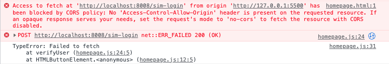
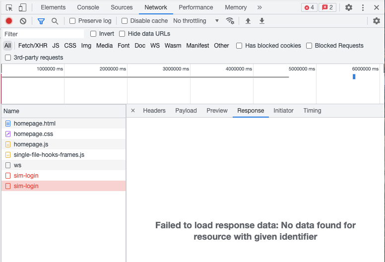
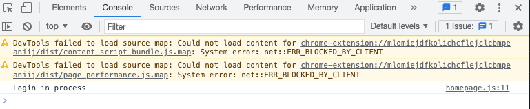
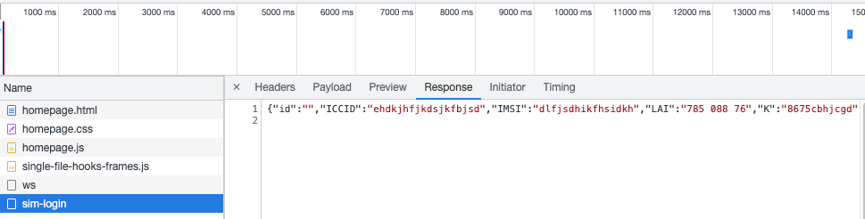

## Sim Card login: Frontend/Backend
This section is dedicated for a building a frontend with HTML, CSS and JavaScript that is related to a Go REST backend in order to provide a user sim login: 
1) Insert user sim credentials from the frontend, then to be stored in a postgres db.
2) List all users data from the databse of sim users.

You can clone the repo or the any piece of code provieded here. This tuto will not go deeper into the spteps of building the frontend and backend given that it is a simple scenario that looks like the first [hands-on lab](https://gitlab.inria.fr/fantastic-fanfare/adorable_alien/-/tree/develop/Hands-on%201%3A%20Go%20REST%20API%20with%20PostgreSQL%20and%20Mux) of how to build a REST API in Go with Postgres.
However in this doc, we will discuss a problem related to resource sharing between servers/apps that we have faced while testing our requests.

### Simple Go REST API with CORS handling:
#### Resource Security Issue
When building our REST API as simple as for usual cases, we countered an issue with network requests that indicates a failure in fetching data from the server and sending back to our backend. The URL we are trying to access, for instance, is `http://localhost:8008/sim-login` which is an endpoint for a POST request where the user logs in his sim card credentials to be stored next in our postgres db.   
Here are some screenshots from our console after trying to insert a user sim credentials from js frontend.  
- Even if the request itself is successful, the latter is preventing from completing because of a network access error.


- We thus got no response back from our backend because we didn't configure a proper resource access.


Making requests from different **origins** (protocol, port and domain) will cause the browser to block the one that is not similar from which is was served. Browsers enforce the **Same-Origin Policy**, which restricts cross-origin requests by default for security reasons. 

#### Solution: CORS Headers
**CORS** (Cross-Origin Resource Sharing) is a web browser based mechanism that allows not only one but different origins (frontend) to access resources and interact with it from the backend. Click here for more details about [Golang CORS handling](https://www.stackhawk.com/blog/golang-cors-guide-what-it-is-and-how-to-enable-it/).

So getting back to our issue, as you could see in the screenshots above, the request is not successfully working. Why?

The answer is, as you probably suspect in the code provided, the same-origin policy. The Golang app runs on port 8008. However, the client JS app runs on port 5500. As you've seen, **simply having different port numbers is already enough for two URLs to be considered different origins**.

Hence, we will need to define a CORS header `Access-Control-Allow-Origin` to specify which origins are allowed to access the resource.

For that, we will first import Go standard library for CORS which is `rs/cors`. Then with `mux`, configure the CORS header with speficied options as follows:
```go
r := mux.NewRouter()

c := cors.New(cors.Options{
 AllowedOrigins: []string{"http://localhost:5500"},
})
handler := c.Handler(r)
```

Or by the default options which includes allowing requests from any origin (Access-Control-Allow-Origin: *), allowing common HTTP methods, and handling CORS preflight requests. We will use the latter method for our case. Here's a code snippet of how it will look like:
```go
r := mux.NewRouter()
	r.HandleFunc("/", func(w http.ResponseWriter, r *http.Request) {
		w.Header().Set("Content-Type", "application/json")
		w.Write([]byte("{\"hello\": \"world\"}"))
	})

	// Use default options
	handler := cors.Default().Handler(r)
	http.ListenAndServe(":8008", handler)
```

After updating our code, the problem should be solved as we can see in the broswer the following results:

